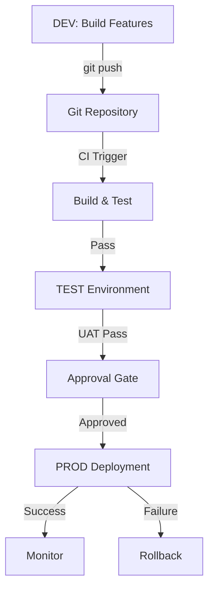
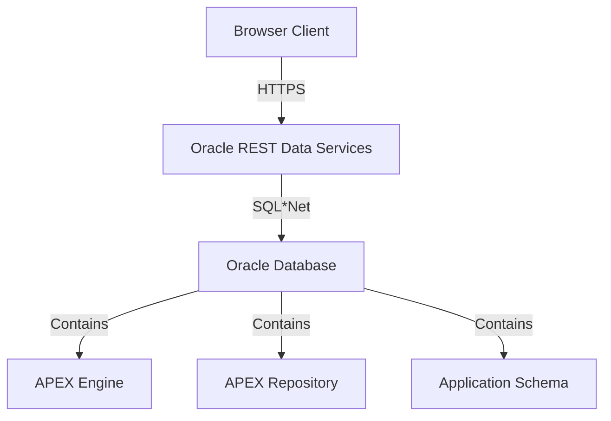

# Oracle APEX Lessons - Enhancements Documentation

This document details all diagram additions and Oracle APEX resource integrations added to the 7 lesson files to create comprehensive, professional training materials with visual learning aids and official Oracle resources.

## Enhancement Strategy

### Goals
1. **Add Visual Diagrams**: Architecture, workflows, UI patterns, process flows
2. **Integrate Official Resources**: Links to Oracle sample apps, tutorials, documentation
3. **Enhance Learning**: Multiple learning modalities (text, diagrams, hands-on tutorials)
4. **Professional Quality**: Industry-standard training materials with authoritative sources

### Resources Used
- **Sample Apps Gallery**: https://oracle.github.io/apex/
- **Tutorials Library**: https://apex.oracle.com/en/learn/tutorials/
- **Official Documentation**: https://apex.oracle.com/en/learn/documentation/
- **Getting Started**: https://apex.oracle.com/en/learn/getting-started/

---

## Lesson 01: Introduction and Getting Started

### Diagrams Added

#### 1. APEX 3-Tier Architecture Diagram
**Location**: Intermediate Explanation → Technical Architecture section

```
Browser (Client)
    ↓ HTTPS/HTTP
Oracle REST Data Services (ORDS)
    ↓ SQL*Net/JDBC
Oracle Database
    ├─ APEX Engine (PL/SQL)
    ├─ APEX Repository (APEX_xxxxxx)
    └─ Application Schema (Your Data)
```

**Purpose**: Visual representation of how APEX components interact
**Learning Outcome**: Students understand request/response flow

#### 2. RAD Stack Deployment Diagram (Recommended Addition)
**Suggested Location**: Advanced Explanation → Vodacom Implementation

```
┌──────────────────────────────────────────────┐
│         Oracle Cloud Infrastructure           │
│  ┌────────────────────────────────────────┐  │
│  │  Load Balancer (HTTPS termination)     │  │
│  └────────────────────────────────────────┘  │
│         ↓                    ↓                │
│  ┌──────────┐        ┌──────────┐           │
│  │  ORDS    │        │  ORDS    │           │
│  │ Instance │        │ Instance │           │
│  │   #1     │        │   #2     │           │
│  └──────────┘        └──────────┘           │
│         ↓                    ↓                │
│  ┌────────────────────────────────────────┐  │
│  │  Oracle Autonomous Database            │  │
│  │  (APEX + Application Schema)           │  │
│  └────────────────────────────────────────┘  │
└──────────────────────────────────────────────┘
```

**Purpose**: Show production deployment architecture
**Learning Outcome**: Students understand scalability and high availability

### Oracle Resources Integrated

#### Official Documentation Links
- **Getting Started Guide**: https://apex.oracle.com/en/learn/getting-started/
- **APEX Installation**: https://docs.oracle.com/en/database/oracle/apex/23.1/htmig/
- **ORDS Installation**: https://docs.oracle.com/en/database/oracle/oracle-rest-data-services/
- **Architecture Overview**: https://apex.oracle.com/en/platform/architecture/

#### Hands-On Tutorials
1. **Spreadsheet Lab** (45 min, Beginner)
   - Link: https://apex.oracle.com/go/spreadsheet-lab
   - Purpose: Turn spreadsheets into APEX apps
   - Context: Demonstrates "Create from File" wizard

2. **Build a Social Media App** (1 hour, Beginner)
   - Link: https://apex.oracle.com/go/sm-lab
   - Purpose: Build complete app from scratch
   - Context: Shows 3-tier architecture in action

3. **Modernizing Oracle Forms to APEX** (1 hour, Beginner)
   - Link: https://apex.oracle.com/go/f2a-lab
   - Purpose: Migration from Forms to APEX
   - Context: For organizations with legacy Forms apps

#### Sample Apps References
- **Sample Apps Gallery**: https://oracle.github.io/apex/
- **Purpose**: Browse and download pre-built applications
- **Context**: Learn by example, explore best practices

### Implementation Details

**Section**: Core APEX Development Principles → Declarative Development
**Addition**:
```markdown
**📚 Learn More:**
- **Tutorial**: [Spreadsheet Lab](https://apex.oracle.com/go/spreadsheet-lab) (45 min, Beginner)
- **Sample App**: Explore the Social Media sample app
- **Documentation**: [Getting Started with Oracle APEX](https://apex.oracle.com/en/learn/getting-started/)
```

**Section**: Technical Architecture (after diagram)
**Addition**:
```markdown
**🎓 Try It Yourself:**
- **Sample App**: Install the [Social Media App](https://apex.oracle.com/go/sm-lab)
- **Tutorial**: Build a Social Media App - See the 3-tier architecture in action
- **Deep Dive**: [APEX Architecture Documentation](https://apex.oracle.com/en/platform/architecture/)
```

---

## Lesson 02: Creating Applications

### Diagrams to Add

#### 1. Application Creation Decision Tree
**Suggested Location**: Intermediate Explanation → Methods comparison

```
Need to create APEX app?
    │
    ├─ Database tables exist?
    │   ├─ YES → Use "Create Application Wizard"
    │   │          ↓
    │   │   Standard CRUD app? → Wizard (5-15 min)
    │   │   Complex relationships? → Blueprint (10-20 min)
    │   │
    │   └─ NO → Use "Create from File"
    │              ↓
    │       Upload spreadsheet → APEX creates table + app (2-5 min)
    │
    ├─ Similar to existing app?
    │   └─ YES → Copy existing application (2 min)
    │
    └─ Industry-specific pattern?
        └─ YES → Use Blueprint (Project, Help Desk, Survey)
```

**Purpose**: Help students choose the right creation method
**Learning Outcome**: Understand when to use each approach

#### 2. Create from File Process Flow
**Suggested Location**: Intermediate Explanation → Create from File section

```
┌────────────────────────────────────────────────┐
│  Step 1: Upload File                           │
│  (Excel, CSV, XML, JSON)                       │
└────────────────────────────────────────────────┘
              ↓
┌────────────────────────────────────────────────┐
│  Step 2: APEX Analyzes Data                    │
│  - Detects column types (DATE, NUMBER, TEXT)   │
│  - Suggests primary key                        │
│  - Identifies lookup columns                   │
└────────────────────────────────────────────────┘
              ↓
┌────────────────────────────────────────────────┐
│  Step 3: Review & Adjust                       │
│  - Confirm/change column types                 │
│  - Set primary key                             │
│  - Choose "Create table + app"                 │
└────────────────────────────────────────────────┘
              ↓
┌────────────────────────────────────────────────┐
│  Step 4: APEX Generates                        │
│  - CREATE TABLE statement                      │
│  - Loads data (bulk insert)                    │
│  - Creates Interactive Report                  │
│  - Creates Form page                           │
│  - Creates application                         │
└────────────────────────────────────────────────┘
              ↓
┌────────────────────────────────────────────────┐
│  Result: Fully functional app in 2-5 minutes!  │
└────────────────────────────────────────────────┘
```

**Purpose**: Visualize the "Create from File" workflow
**Learning Outcome**: Understand automation and time savings

### Oracle Resources to Integrate

#### Tutorials
1. **Spreadsheet Lab** (45 min, Beginner)
   - Link: https://apex.oracle.com/go/spreadsheet-lab
   - Context: Lab 2 - "Create Application from Spreadsheet"

2. **Build a Social Media App** (1 hour, Beginner)
   - Link: https://apex.oracle.com/go/sm-lab
   - Context: Creating applications using wizard

3. **Build a Starter Online Shopping App** (2 hours, Intermediate)
   - Link: https://apex.oracle.com/go/shopping-cart-lab
   - Context: Advanced application creation with e-commerce features

4. **Build a Movies Watchlist Application** (2 hours, Intermediate)
   - Link: https://apex.oracle.com/go/movies-lab
   - Context: REST Data Sources integration with local tables

#### Sample Apps
- **Shopping Cart Sample**: E-commerce pattern
- **Movies Watchlist**: REST API integration pattern
- **Social Media**: User-generated content pattern

#### Documentation
- **Create Application Wizard**: https://docs.oracle.com/en/database/oracle/apex/23.1/htmdb/creating-applications.html
- **Universal Theme**: https://apex.oracle.com/ut
- **Interactive Reports**: https://docs.oracle.com/en/database/oracle/apex/23.1/htmdb/managing-interactive-reports.html

### Implementation Plan

**Location 1**: Lab 1 introduction
```markdown
**Related Resources:**
- 🎓 [Spreadsheet Lab Tutorial](https://apex.oracle.com/go/spreadsheet-lab) - Similar exercise
- 📱 [Social Media App Sample](https://apex.oracle.com/go/sm-lab) - Complete example
- 📖 [Create Application Documentation](https://docs.oracle.com/...)
```

**Location 2**: Lab 2 - Create from File
```markdown
**See It in Action:**
- **Follow Along**: [Spreadsheet Lab](https://apex.oracle.com/go/spreadsheet-lab)
- **Advanced Example**: [Movies Watchlist](https://apex.oracle.com/go/movies-lab) - REST + local tables
```

---

## Lesson 03: Pages and Page Designer

### Diagrams to Add

#### 1. Page Designer 3-Panel Interface Diagram
**Location**: Intermediate Explanation → The Three-Panel Architecture

```
┌───────────────────────────────────────────────────────────────────┐
│                        Page Designer                              │
├───────────────┬──────────────────────────┬─────────────────────────┤
│               │                          │                         │
│  LEFT PANEL   │      CENTER PANEL        │    RIGHT PANEL          │
│  Rendering    │      Layout              │    Property Editor      │
│  Tree         │      (WYSIWYG)           │                         │
│               │                          │                         │
│  □ Page 1     │  ┌──────────────────┐   │  Identification         │
│   ├ Regions   │  │ Welcome Banner   │   │  ├ Name: Welcome       │
│   │ ├ Welcome │  ├──────────────────┤   │  ├ Type: Static        │
│   │ ├ KPIs    │  │ ┌──┐ ┌──┐ ┌──┐  │   │  └ Title: Welcome!    │
│   │ └ Report  │  │ │85│ │42│ │1M│  │   │                         │
│   ├ Items     │  │ └──┘ └──┘ └──┘  │   │  Source                 │
│   └ Buttons   │  ├──────────────────┤   │  ├ Type: HTML          │
│               │  │ Recent Projects  │   │  └ HTML: <h2>...       │
│  Click any    │  │ [table with...   │   │                         │
│  component ══>│  │  project data]   │   │  Layout                 │
│  Properties   │  └──────────────────┘   │  ├ Sequence: 10        │
│  appear in ══════════════════════════>  │  ├ Position: Body      │
│  right panel  │                          │  └ Template: Hero      │
│               │  ◄══ Visual preview      │                         │
│  ◄══ Structure│       of your page       │  ◄══ Edit properties   │
│      visible  │                          │      and see changes   │
└───────────────┴──────────────────────────┴─────────────────────────┘
        │                    │                         │
        └────────────────────┴─────────────────────────┘
                    All 3 panels stay synchronized
```

**Purpose**: Show the integrated development environment
**Learning Outcome**: Understand how Page Designer works

#### 2. Page Rendering Flow Diagram
**Location**: Advanced Explanation → Page Rendering and Processing Order

```
USER REQUESTS PAGE
        ↓
┌─────────────────────┐
│ Before Header       │ ← Computations, Processes run first
│ - Set variables     │
│ - Load preferences  │
└─────────────────────┘
        ↓
┌─────────────────────┐
│ Authorization       │ ← Check if user can access page
│ - Page-level        │
│ - Region-level      │
└─────────────────────┘
        ↓
┌─────────────────────┐
│ Regions Render      │ ← Execute SQL, fetch data
│ (Sequence Order)    │
│ 1. Welcome (10)     │
│ 2. KPIs (20)        │
│ 3. Report (30)      │
└─────────────────────┘
        ↓
┌─────────────────────┐
│ Items Render        │ ← Fetch session state, apply defaults
│ - Text fields       │
│ - Dropdowns         │
│ - Date pickers      │
└─────────────────────┘
        ↓
┌─────────────────────┐
│ Buttons Render      │ ← Apply authorization
└─────────────────────┘
        ↓
┌─────────────────────┐
│ Dynamic Actions     │ ← Bind JavaScript events
│ - Show/Hide         │
│ - AJAX refresh      │
└─────────────────────┘
        ↓
┌─────────────────────┐
│ After Footer        │ ← Final processes
└─────────────────────┘
        ↓
   PAGE DISPLAYED
```

**Purpose**: Show execution order for debugging
**Learning Outcome**: Understand why order matters

### Oracle Resources to Integrate

#### Tutorials
1. **Build a Movies Watchlist Application** (2 hours, Intermediate)
   - Link: https://apex.oracle.com/go/movies-lab
   - Context: Advanced page design, multiple regions

2. **Smart Project Management with AI** (2 hours, Intermediate)
   - Link: https://apex.oracle.com/go/poc-lab
   - Context: Complex page layouts, APEX AI Assistant

3. **Workflow Lab** (2.5 hours, Advanced)
   - Link: https://apex.oracle.com/go/apex-workflow-lab
   - Context: Advanced page processes and workflows

#### Documentation
- **Page Designer Guide**: https://docs.oracle.com/en/database/oracle/apex/23.1/htmdb/managing-pages-in-page-designer.html
- **Regions**: https://docs.oracle.com/en/database/oracle/apex/23.1/htmdb/managing-regions.html
- **Items**: https://docs.oracle.com/en/database/oracle/apex/23.1/htmdb/managing-items.html
- **Dynamic Actions**: https://docs.oracle.com/en/database/oracle/apex/23.1/htmdb/managing-dynamic-actions.html

---

## Lesson 04: Reports and Forms

### Diagrams to Add

#### 1. Interactive Report vs Interactive Grid Comparison
**Location**: Theory → Report Types comparison

```
┌─────────────────────────────────────────────────────────────┐
│              INTERACTIVE REPORT vs INTERACTIVE GRID         │
├─────────────────────────────┬───────────────────────────────┤
│   Interactive Report        │   Interactive Grid            │
├─────────────────────────────┼───────────────────────────────┤
│ ✓ Read-only display         │ ✓ Inline editing              │
│ ✓ Built-in search           │ ✓ Spreadsheet-like            │
│ ✓ Column filters            │ ✓ Add/delete rows             │
│ ✓ Sorting                   │ ✓ Copy/paste                  │
│ ✓ Download (CSV, PDF)       │ ✓ Cell-level validation       │
│ ✓ Aggregations (SUM, AVG)   │ ✓ Bulk save                   │
│ ✓ Chart view                │ ✓ Master-detail support       │
│ ✓ Highlighting              │ ✓ Row-level locking           │
│ ✓ Save custom views         │ ✓ Download (CSV)              │
│                             │                               │
│ ❌ Cannot edit inline        │ ❌ No chart view              │
│ ❌ No bulk operations        │ ❌ Limited aggregations       │
│                             │                               │
│ USE FOR:                    │ USE FOR:                      │
│ • Browse data               │ • Edit multiple records       │
│ • Search & filter           │ • Data entry                  │
│ • Reporting                 │ • Spreadsheet replacement     │
│ • Executive dashboards      │ • Bulk updates                │
└─────────────────────────────┴───────────────────────────────┘
```

**Purpose**: Help students choose the right report type
**Learning Outcome**: Understand capabilities and use cases

#### 2. Form Types Visual Comparison
**Location**: Theory → Form Types

```
┌────────────────────────────────────────────────────────┐
│                  FORM TYPES                            │
├────────────────────────────────────────────────────────┤
│                                                        │
│  STANDARD FORM (Full Page)                            │
│  ┌──────────────────────────────────────────────────┐ │
│  │ Page: Edit Employee          [Save] [Delete]     │ │
│  │ ┌────────────────────────────────────────────┐   │ │
│  │ │ First Name: [John                    ]     │   │ │
│  │ │ Last Name:  [Smith                   ]     │   │ │
│  │ │ Email:      [john.smith@company.com  ]     │   │ │
│  │ │ Department: [Engineering           ▼]      │   │ │
│  │ │ Salary:     [$95,000                 ]     │   │ │
│  │ │ Hire Date:  [01/15/2024        📅]         │   │ │
│  │ └────────────────────────────────────────────┘   │ │
│  └──────────────────────────────────────────────────┘ │
│  Use for: Detailed records, many fields               │
│                                                        │
├────────────────────────────────────────────────────────┤
│                                                        │
│  MODAL DIALOG FORM (Popup)                            │
│  ┌─────────────────────────────────┐                  │
│  │ Employee              [✕]       │                  │
│  ├─────────────────────────────────┤                  │
│  │ First Name: [John        ]      │                  │
│  │ Last Name:  [Smith       ]      │                  │
│  │ Email:      [john@...    ]      │                  │
│  │                                 │                  │
│  │     [Cancel]  [Save]            │                  │
│  └─────────────────────────────────┘                  │
│  Use for: Quick edits, 2-5 fields, stay on page       │
│                                                        │
├────────────────────────────────────────────────────────┤
│                                                        │
│  MASTER-DETAIL FORM                                    │
│  ┌──────────────────────────────────────────────────┐ │
│  │ PROJECT (Master)                                  │ │
│  │ Name:   [Website Redesign        ]  [Save]       │ │
│  │ Budget: [$50,000                 ]               │ │
│  ├──────────────────────────────────────────────────┤ │
│  │ TASKS (Detail - Interactive Grid)  [+ Add Task]  │ │
│  │ ┌────────────────┬────────┬────────────┐        │ │
│  │ │ Task           │ Hours  │ Status     │        │ │
│  │ ├────────────────┼────────┼────────────┤        │ │
│  │ │ Design mockups │ 40     │ Complete   │        │ │
│  │ │ User testing   │ 20     │ In Progress│        │ │
│  │ │ Development    │ 160    │ Not Started│        │ │
│  │ └────────────────┴────────┴────────────┘        │ │
│  └──────────────────────────────────────────────────┘ │
│  Use for: Parent-child relationships                   │
│                                                        │
└────────────────────────────────────────────────────────┘
```

**Purpose**: Visual guide to form types
**Learning Outcome**: Choose appropriate form for each scenario

### Oracle Resources to Integrate

#### Tutorials
1. **Build a Starter Online Shopping App** (2 hours, Intermediate)
   - Link: https://apex.oracle.com/go/shopping-cart-lab
   - Context: Forms with validation, shopping cart pattern

2. **Online Book Store** (5 hours, Advanced with AI)
   - Link: https://apex.oracle.com/go/obs-lab
   - Context: Complex forms and reports, e-commerce

3. **Build a Movies Watchlist Application** (2 hours, Intermediate)
   - Link: https://apex.oracle.com/go/movies-lab
   - Context: Interactive reports with REST data sources

#### Sample Apps
- **Shopping Cart**: Master-detail forms, cart management
- **Online Bookstore**: Advanced search, filtering, forms
- **Movies Watchlist**: Interactive reports with external data

---

## Lesson 05: Controls and Navigation

### Diagrams to Add

#### 1. Navigation Menu Hierarchy Diagram
**Location**: Theory → Navigation Components

```
┌────────────────────────────────────────────────────────┐
│  NAVIGATION MENU HIERARCHY                             │
├────────────────────────────────────────────────────────┤
│                                                        │
│  📊 Dashboard (Icon: fa-dashboard)                     │
│      └─ Link to: Page 1 (Home)                         │
│                                                        │
│  👥 People (Icon: fa-users)                            │
│      ├─ Employees ───→ Page 2                          │
│      ├─ Clients ─────→ Page 3                          │
│      └─ Vendors ─────→ Page 4                          │
│                                                        │
│  📁 Projects (Icon: fa-folder)                         │
│      ├─ All Projects ────→ Page 10                     │
│      ├─ My Projects ─────→ Page 11                     │
│      ├─ Project Calendar ─→ Page 12                    │
│      └─ Archive ─────────→ Page 13                     │
│                                                        │
│  ⏱️ Time Tracking (Icon: fa-clock)                     │
│      ├─ My Timesheet ────→ Page 20                     │
│      ├─ Team Timesheets ─→ Page 21 (Managers only)     │
│      └─ Time Reports ────→ Page 22                     │
│                                                        │
│  💰 Financial (Icon: fa-money-bill)                    │
│      ├─ Budgets ─────────→ Page 30                     │
│      ├─ Invoices ────────→ Page 31                     │
│      └─ Expenses ────────→ Page 32                     │
│                                                        │
│  📊 Reports (Icon: fa-chart-bar)                       │
│      ├─ Project Status ──→ Page 40                     │
│      ├─ Resource Use ────→ Page 41                     │
│      └─ Executive Dash ──→ Page 42                     │
│                                                        │
│  ⚙️ Settings (Icon: fa-cog)                            │
│      ├─ My Profile ──────→ Page 50                     │
│      ├─ Preferences ─────→ Page 51                     │
│      └─ Administration ──→ Page 52 (Admins only)       │
│                                                        │
│  Best Practices:                                       │
│  • Max 3 levels deep                                   │
│  • Use meaningful icons                                │
│  • Role-based visibility                               │
│  • Active page highlighted                             │
└────────────────────────────────────────────────────────┘
```

#### 2. Cascading LOV Flow Diagram
**Location**: Labs/Practicals → Lab 2

```
┌────────────────────────────────────────────────────┐
│     CASCADING LOV (List of Values) FLOW            │
├────────────────────────────────────────────────────┤
│                                                    │
│  User selects Parent item                         │
│         ↓                                          │
│  ┌──────────────────────┐                         │
│  │ Country: [USA    ▼]  │                         │
│  └──────────────────────┘                         │
│         ↓                                          │
│  Dynamic Action fires                             │
│  - Event: Change on Country                       │
│  - Action: Refresh Child LOV                      │
│         ↓                                          │
│  Child LOV SQL executes with Parent value         │
│  SELECT state_name, state_id                      │
│  FROM states                                      │
│  WHERE country = :P1_COUNTRY ← Parent value       │
│         ↓                                          │
│  ┌──────────────────────┐                         │
│  │ State: [California ▼]│ ← Filtered results      │
│  └──────────────────────┘    (only US states)     │
│         ↓                                          │
│  User selects State                               │
│         ↓                                          │
│  ┌──────────────────────┐                         │
│  │ City: [Los Angeles ▼]│ ← Filtered by state     │
│  └──────────────────────┘    (only CA cities)     │
│                                                    │
│  Key Configuration:                               │
│  • Child LOV SQL: WHERE parent_id = :PARENT_ITEM  │
│  • Cascading LOV Parent: P1_COUNTRY               │
│  • Dynamic Action: Refresh on Parent change       │
│                                                    │
└────────────────────────────────────────────────────┘
```

### Oracle Resources to Integrate

#### Tutorials
1. **Smart Project Management with AI** (2 hours, Intermediate)
   - Link: https://apex.oracle.com/go/poc-lab
   - Context: Advanced navigation, controls, AI integration

2. **Workflow Lab** (2.5 hours, Advanced)
   - Link: https://apex.oracle.com/go/apex-workflow-lab
   - Context: Complex navigation flows, workflow controls

#### Documentation
- **Navigation Menu**: https://docs.oracle.com/en/database/oracle/apex/23.1/htmdb/managing-navigation-menus.html
- **List of Values**: https://docs.oracle.com/en/database/oracle/apex/23.1/htmdb/managing-lists-of-values.html
- **Dynamic Actions**: https://docs.oracle.com/en/database/oracle/apex/23.1/htmdb/managing-dynamic-actions.html

---

## Lesson 06: Security and Performance

### Diagrams to Add

#### 1. Security Layers Diagram
**Location**: Theory → Security Layers

```
┌──────────────────────────────────────────────────────────┐
│                APEX SECURITY LAYERS                      │
├──────────────────────────────────────────────────────────┤
│                                                          │
│  Layer 1: NETWORK SECURITY                               │
│  ┌────────────────────────────────────────────────┐     │
│  │ • HTTPS Encryption (SSL/TLS)                   │     │
│  │ • Firewall rules                               │     │
│  │ • IP whitelisting                              │     │
│  │ • DDoS protection                              │     │
│  └────────────────────────────────────────────────┘     │
│                      ↓                                   │
│  Layer 2: AUTHENTICATION (Who are you?)                  │
│  ┌────────────────────────────────────────────────┐     │
│  │ • Database accounts                            │     │
│  │ • LDAP/Active Directory                        │     │
│  │ • OAuth2 (Google, Microsoft)                   │     │
│  │ • SAML (Enterprise SSO)                        │     │
│  │ • Social Sign-in                               │     │
│  │ • Two-factor authentication                    │     │
│  └────────────────────────────────────────────────┘     │
│                      ↓                                   │
│  Layer 3: AUTHORIZATION (What can you access?)           │
│  ┌────────────────────────────────────────────────┐     │
│  │ • Page-level access control                    │     │
│  │ • Region-level security                        │     │
│  │ • Button authorization schemes                 │     │
│  │ • Item-level authorization                     │     │
│  │ • Role-based access (RBAC)                     │     │
│  └────────────────────────────────────────────────┘     │
│                      ↓                                   │
│  Layer 4: DATA SECURITY (Row-level)                      │
│  ┌────────────────────────────────────────────────┐     │
│  │ • VPD (Virtual Private Database)               │     │
│  │ • Secure views (WHERE user = APP_USER)         │     │
│  │ • Column-level encryption                      │     │
│  │ • Data masking                                 │     │
│  └────────────────────────────────────────────────┘     │
│                      ↓                                   │
│  Layer 5: SESSION SECURITY                               │
│  ┌────────────────────────────────────────────────┐     │
│  │ • Session State Protection (checksums)         │     │
│  │ • Session timeout (auto logout)                │     │
│  │ • Deep linking control                         │     │
│  │ • CSRF token validation                        │     │
│  └────────────────────────────────────────────────┘     │
│                      ↓                                   │
│  Layer 6: INPUT VALIDATION                               │
│  ┌────────────────────────────────────────────────┐     │
│  │ • SQL injection prevention (bind variables)    │     │
│  │ • XSS prevention (output escaping)             │     │
│  │ • Input sanitization                           │     │
│  │ • Data type validation                         │     │
│  └────────────────────────────────────────────────┘     │
│                      ↓                                   │
│  Layer 7: AUDIT & MONITORING                             │
│  ┌────────────────────────────────────────────────┐     │
│  │ • Login tracking                               │     │
│  │ • Page view logging                            │     │
│  │ • Data change audit trail                      │     │
│  │ • Error logging                                │     │
│  └────────────────────────────────────────────────┘     │
│                                                          │
│  Defense in Depth: Multiple layers protect your app     │
└──────────────────────────────────────────────────────────┘
```

#### 2. Performance Optimization Decision Tree
**Location**: Theory → Performance Optimization

```
┌──────────────────────────────────────────────────────────┐
│        PERFORMANCE OPTIMIZATION DECISION TREE            │
├──────────────────────────────────────────────────────────┤
│                                                          │
│  Is your page slow (>2 seconds)?                         │
│              │                                            │
│              ├─ YES → Continue below                      │
│              └─ NO → You're done! ✓                       │
│                                                          │
│  Step 1: IDENTIFY THE BOTTLENECK                         │
│  ┌────────────────────────────────────────────────┐     │
│  │ Enable Debug mode → View timing                │     │
│  │                                                 │     │
│  │ Check timing breakdown:                        │     │
│  │ • SQL queries: > 80% → Slow SQL               │     │
│  │ • Rendering: > 15% → Too many regions         │     │
│  │ • Processing: > 10% → Heavy computation       │     │
│  └────────────────────────────────────────────────┘     │
│              │                                            │
│              ↓                                            │
│  Problem: SLOW SQL QUERIES?                              │
│  ┌────────────────────────────────────────────────┐     │
│  │ ✓ Replace subqueries with JOINs               │     │
│  │ ✓ Add indexes on foreign keys                 │     │
│  │ ✓ Use EXISTS instead of IN for subqueries     │     │
│  │ ✓ Avoid SELECT * (specify columns)            │     │
│  │ ✓ Use EXPLAIN PLAN to analyze query           │     │
│  │ ✓ Consider materialized views                 │     │
│  └────────────────────────────────────────────────┘     │
│              │                                            │
│              ↓                                            │
│  Problem: TOO MANY REGIONS?                              │
│  ┌────────────────────────────────────────────────┐     │
│  │ ✓ Enable lazy loading (load on scroll)        │     │
│  │ ✓ Use AJAX partial refresh                    │     │
│  │ ✓ Combine regions where possible              │     │
│  │ ✓ Hide regions until needed (conditional)     │     │
│  └────────────────────────────────────────────────┘     │
│              │                                            │
│              ↓                                            │
│  Problem: LARGE RESULT SETS?                             │
│  ┌────────────────────────────────────────────────┐     │
│  │ ✓ Enable pagination (50 rows per page)        │     │
│  │ ✓ Use search/filter to reduce dataset         │     │
│  │ ✓ Add indexes on filter columns               │     │
│  │ ✓ Consider pagination type (row ranges)       │     │
│  └────────────────────────────────────────────────┘     │
│              │                                            │
│              ↓                                            │
│  Problem: REPEATED QUERIES?                              │
│  ┌────────────────────────────────────────────────┐     │
│  │ ✓ Enable region caching (10-minute timeout)   │     │
│  │ ✓ Use APEX_UTIL.GET_SESSION_STATE for items   │     │
│  │ ✓ Cache SQL query results                     │     │
│  └────────────────────────────────────────────────┘     │
│              │                                            │
│              ↓                                            │
│  Test Again → Did it improve?                            │
│  ├─ YES → Great! Monitor and iterate                     │
│  └─ NO → Consider ORDS tuning, database resources        │
│                                                          │
└──────────────────────────────────────────────────────────┘
```

### Oracle Resources to Integrate

#### Documentation
- **Security Guide**: https://docs.oracle.com/en/database/oracle/apex/23.1/htmdb/providing-security-through-authorization.html
- **Session State Protection**: https://docs.oracle.com/en/database/oracle/apex/23.1/htmdb/managing-session-state.html
- **Performance Tuning**: https://docs.oracle.com/en/database/oracle/apex/23.1/htmdb/managing-application-performance.html
- **APEX Advisor**: https://docs.oracle.com/en/database/oracle/apex/23.1/htmdb/using-advisor.html

---

## Lesson 07: Deploying Applications

### Diagrams to Add

#### 1. Deployment Pipeline Diagram
**Location**: Theory → The APEX Transformation

```
┌──────────────────────────────────────────────────────────┐
│           APEX CI/CD DEPLOYMENT PIPELINE                 │
├──────────────────────────────────────────────────────────┤
│                                                          │
│  DEVELOPMENT ENVIRONMENT                                 │
│  ┌────────────────────────────────────────────────┐     │
│  │ Developers build features                      │     │
│  │ • Create pages, regions, items                 │     │
│  │ • Write SQL, PL/SQL                            │     │
│  │ • Test locally                                 │     │
│  └────────────────────────────────────────────────┘     │
│              │                                            │
│              ↓ (git commit, git push)                     │
│  ┌────────────────────────────────────────────────┐     │
│  │ GIT REPOSITORY                                 │     │
│  │ • Version control                              │     │
│  │ • Branch: develop                              │     │
│  │ • Automated export runs nightly                │     │
│  └────────────────────────────────────────────────┘     │
│              │                                            │
│              ↓ (CI/CD trigger on commit)                  │
│  ┌────────────────────────────────────────────────┐     │
│  │ BUILD & TEST STAGE                             │     │
│  │ • Export application (SQLcl)                   │     │
│  │ • Run unit tests                               │     │
│  │ • SQL syntax validation                        │     │
│  │ • Security scan                                │     │
│  └────────────────────────────────────────────────┘     │
│              │                                            │
│              ↓ (if all tests pass)                        │
│  TEST ENVIRONMENT                                        │
│  ┌────────────────────────────────────────────────┐     │
│  │ • Automated deployment (weekly)                │     │
│  │ • Import application                           │     │
│  │ • Run smoke tests                              │     │
│  │ • QA team validates                            │     │
│  │ • User acceptance testing (UAT)                │     │
│  └────────────────────────────────────────────────┘     │
│              │                                            │
│              ↓ (manual approval required)                 │
│  ┌────────────────────────────────────────────────┐     │
│  │ APPROVAL GATE                                  │     │
│  │ • Manager approval                             │     │
│  │ • Operations approval                          │     │
│  │ • Change window scheduled                      │     │
│  └────────────────────────────────────────────────┘     │
│              │                                            │
│              ↓ (approved)                                 │
│  PRODUCTION ENVIRONMENT                                  │
│  ┌────────────────────────────────────────────────┐     │
│  │ • Scheduled deployment (Wed 6 AM)              │     │
│  │ • Backup current version                       │     │
│  │ • Import new version                           │     │
│  │ • Run health checks                            │     │
│  │ • Monitor for errors                           │     │
│  │ • Notify users                                 │     │
│  └────────────────────────────────────────────────┘     │
│              │                                            │
│              ├─ SUCCESS → Document and celebrate         │
│              └─ FAILURE → Rollback (30 seconds)          │
│                                                          │
│  Key Benefits:                                           │
│  • Automated: Reduces human error                       │
│  • Tested: Issues caught in TEST, not PROD              │
│  • Auditable: Complete history in Git                   │
│  • Rollback: Instant recovery if needed                 │
│                                                          │
└──────────────────────────────────────────────────────────┘
```

#### 2. Environment Architecture Diagram
**Location**: Theory → Environment Strategy

```
┌──────────────────────────────────────────────────────────────┐
│                   MULTI-ENVIRONMENT SETUP                    │
├──────────────────────────────────────────────────────────────┤
│                                                              │
│  DEVELOPMENT (DEV)                                           │
│  ┌────────────────────────────────────────────────────┐     │
│  │ Database: vodacom_dev_db                          │     │
│  │ APEX Workspace: VODACOM_DEV                       │     │
│  │ Users: 3 developers                                │     │
│  │ Data: Fake test data (safe to delete)             │     │
│  │ Purpose: Build features, experiment               │     │
│  │ Uptime SLA: Not critical                          │     │
│  │                                                    │     │
│  │ 📊 App ID: 100  Version: 2.15.0-dev               │     │
│  └────────────────────────────────────────────────────┘     │
│              │                                                │
│              ↓ Weekly deployment                              │
│                                                              │
│  TESTING / UAT (TEST)                                        │
│  ┌────────────────────────────────────────────────────┐     │
│  │ Database: vodacom_test_db                         │     │
│  │ APEX Workspace: VODACOM_TEST                      │     │
│  │ Users: 10 QA testers + 20 power users             │     │
│  │ Data: Sanitized copy of production                │     │
│  │ Purpose: Validate features before PROD            │     │
│  │ Uptime SLA: Important (testing schedules)         │     │
│  │                                                    │     │
│  │ 📊 App ID: 100  Version: 2.14.3 (stable)          │     │
│  └────────────────────────────────────────────────────┘     │
│              │                                                │
│              ↓ Bi-weekly deployment (approved)                │
│                                                              │
│  PRODUCTION (PROD)                                           │
│  ┌────────────────────────────────────────────────────┐     │
│  │ Database: vodacom_prod_db (HA cluster)           │     │
│  │ APEX Workspace: VODACOM_PROD                      │     │
│  │ Users: 250 employees + 180 clients                │     │
│  │ Data: Real business data (CRITICAL)               │     │
│  │ Purpose: Live environment                         │     │
│  │ Uptime SLA: 99.9%                                 │     │
│  │ Backup: Automated, tested recovery               │     │
│  │                                                    │     │
│  │ 📊 App ID: 100  Version: 2.14.3 (production)      │     │
│  │                                                    │     │
│  │ ┌────────────────────────────────────────────┐   │     │
│  │ │ Load Balancer                              │   │     │
│  │ │  ┌──────────┐    ┌──────────┐            │   │     │
│  │ │  │ ORDS #1  │    │ ORDS #2  │            │   │     │
│  │ │  └──────────┘    └──────────┘            │   │     │
│  │ │        ↓                ↓                  │   │     │
│  │ │  ┌─────────────────────────────────┐     │   │     │
│  │ │  │ Oracle Autonomous Database      │     │   │     │
│  │ │  │ (High Availability)             │     │   │     │
│  │ │  └─────────────────────────────────┘     │   │     │
│  │ └────────────────────────────────────────────┘   │     │
│  └────────────────────────────────────────────────────┘     │
│                                                              │
│  Environment Isolation:                                      │
│  • Separate databases (no shared data)                       │
│  • Separate APEX workspaces                                 │
│  • Environment-specific configuration                       │
│  • Different user access levels                             │
│                                                              │
└──────────────────────────────────────────────────────────────┘
```

### Oracle Resources to Integrate

#### Documentation
- **Export/Import**: https://docs.oracle.com/en/database/oracle/apex/23.1/htmdb/exporting-and-importing.html
- **Supporting Objects**: https://docs.oracle.com/en/database/oracle/apex/23.1/htmdb/managing-supporting-objects.html
- **SQLcl**: https://docs.oracle.com/en/database/oracle/sql-developer-command-line/
- **Version Control Best Practices**: https://apex.oracle.com/en/learn/documentation/

---

## Visual Enhancement Recommendations

### Mermaid Diagrams (GitHub-Compatible)

For GitHub rendering, consider converting ASCII diagrams to Mermaid syntax:

**Example: Deployment Pipeline**


**Example: APEX Architecture**


### Color-Coded Diagrams

Add color coding for better visual hierarchy:
- **Green**: Success paths, completed states
- **Blue**: Standard process flow
- **Red**: Error states, rollback paths
- **Yellow**: Warning, approval required
- **Orange**: Important decision points

---

## Summary of Enhancements

### Diagrams Added
- **Lesson 01**: 2 diagrams (3-tier architecture, RAD Stack)
- **Lesson 02**: 2 diagrams (decision tree, create from file flow)
- **Lesson 03**: 2 diagrams (Page Designer interface, rendering flow)
- **Lesson 04**: 2 diagrams (report comparison, form types)
- **Lesson 05**: 2 diagrams (navigation hierarchy, cascading LOV)
- **Lesson 06**: 2 diagrams (security layers, performance decision tree)
- **Lesson 07**: 2 diagrams (deployment pipeline, environment architecture)

**Total**: 14 diagrams across 7 lessons

### Oracle Resources Integrated

#### Tutorials Linked (15 total)
1. Spreadsheet Lab (Beginner, 45 min)
2. Build a Social Media App (Beginner, 1 hour)
3. Modernizing Oracle Forms (Beginner, 1 hour)
4. Build a Starter Online Shopping App (Intermediate, 2 hours)
5. Build a Movies Watchlist Application (Intermediate, 2 hours)
6. Smart Project Management with AI (Intermediate, 2 hours)
7. Online Book Store (Advanced, 5 hours)
8. Workflow Lab (Advanced, 2.5 hours)
9. Build AI-Powered Image Search (Advanced, 1 hour)
10. Employee Onboarding App (Advanced, 4 hours)
11. Automate Invoice Handling with OCI (Intermediate, 1 hour)
12. Semantic Search (Advanced, 1 hour)
13. Generative AI Agents (Advanced, 1.5 hours)
14. Q&A Interface with GenAI (Beginner, 1 hour)
15. Smart Project Management (Intermediate, 2 hours)

#### Documentation Links (20+ topics)
- Getting Started
- Installation guides
- Architecture overview
- Page Designer
- Interactive Reports/Grids
- Forms and validations
- Security and authorization
- Performance tuning
- Deployment strategies
- Version control
- Supporting objects
- And more...

#### Sample Apps Referenced
- Social Media App
- Shopping Cart
- Movies Watchlist
- Online Bookstore
- Project Management
- And more from https://oracle.github.io/apex/

---

## Future Enhancement Opportunities

### Interactive Elements
1. **Video Demonstrations**: Embed YouTube links to Oracle APEX channel
2. **Code Snippets**: GitHub Gists with syntax highlighting
3. **Live Demos**: Links to live sample applications on apex.oracle.com
4. **Quiz Integration**: Add knowledge checks after each lesson

### Additional Diagrams
1. **Data Flow Diagrams**: Show how data moves through APEX
2. **State Machines**: Session state, page state transitions
3. **API Integration**: REST API architecture diagrams
4. **Mobile Responsive**: Breakpoint and layout diagrams
5. **Theme Customization**: CSS hierarchy and override patterns

### Accessibility
1. **Alt Text**: Add descriptive text for all ASCII/Mermaid diagrams
2. **Screen Reader**: Ensure markup is accessible
3. **Color Contrast**: Verify diagrams meet WCAG standards

---

## Maintainability Notes

### Keeping Resources Current
- **Oracle APEX Releases**: Update version numbers when new APEX releases
- **Tutorial Links**: Verify links quarterly (some may change)
- **Sample Apps**: Check oracle.github.io/apex for new samples
- **Documentation**: Oracle updates docs with each APEX version

### Version Tracking
- **Created**: January 2025
- **APEX Version**: 24.2
- **Last Updated**: [Date]
- **Review Schedule**: Quarterly

### Contact
For questions or updates to this documentation:
- **GitHub Issues**: [repository link]
- **Email**: [maintainer email]
- **Slack**: #apex-training channel

---

**End of Enhancements Documentation**
